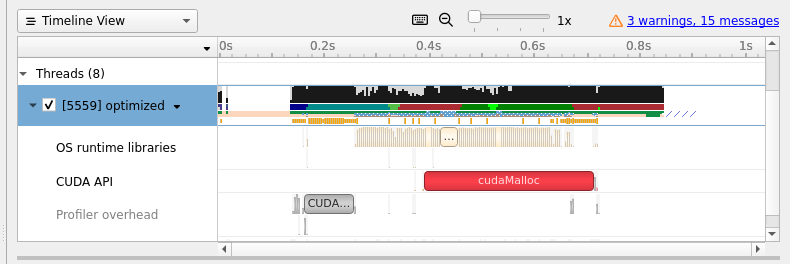

# **TAC-HEP GPUs Final Project**

Throughout the assignment, we use 518x518 arrays as inputs, with a stencil radius of 3.

The C++ executable can be compiled and run on the UW login machines with

```
g++ main.cc -o main
./main
```

The cuda code can be compiled and run on the UW GPU machines after running the following to set up:

```
export LD_LIBRARY_PATH=/usr/local/cuda/lib
export PATH=$PATH:/usr/local/cuda/bin
```

with the compilation and executation commands

```
nvcc <file>.cu -o <executable_name>
./<executable_name>
```

To compile and run the Alpaka solution, one first has to run the following setup commands:

```
source scl_source enable devtoolset-11
export BOOST_BASE=~abocci/public/boost
export ALPAKA_BASE=~/private/alpaka
```

Then, to compile and run with the CPU as the device,

```
g++ -DALPAKA_ACC_CPU_B_SEQ_T_SEQ_ENABLED \
-std=c++17 -O2 -g -I$BOOST_BASE/include -I$ALPAKA_BASE/include \
main.cc \
-o <CPU_executable>
./<CPU_executable>
```

and to compile and run with the GPU as the device,

```
nvcc -x cu –expt-relaxed-constexpr -DALPAKA_ACC_GPU_CUDA_ENABLED \
-std=c++17 -O2 -g -I$BOOST_BASE/include -I$ALPAKA_BASE/include \
main.cc \
-o <GPU_executable>
./<GPU_executable>
```

The nsys outputs are in **<soln_directory>/nsys/stats_report.csv**, while the VTune output for the C++ implementation is in 
**cpp_version/vtune/vtune-output.csv**.

## C++ and CPU profiling
The code for this section is in the directory **cpp_version**.

According to VTune, the CPU matrix multiplication takes up ~95% of the compute time, while the stencils take up ~5% of the time. 
This is despite the fact that there are two stencils applied, while matrix multiplication is only called once.


We can also see that VTune does not think the code uses the CPU effectively, with very low parallelization.


## Porting to CUDA
The version using explicit memory copies and only the default stream is in the directory **base_cuda_soln**. The nsys analysis of this version of the code is shown below.


Of the Cuda API calls, clearly cudaMalloc takes up the most time.

The version using cuda-managed memory is in **managed_cuda_soln**. The nsys analysis is below.


Again, the cudaMalloc takes up the largest portion of time, and that time has increased notably here from the explicit memory copies case. Altogether, the application is slower, but the code was easier to write, even with relatively simple data structures. It makes sense that more complex data structures would make writing the code with unified memory much easier.

## Optimizing performance in CUDA
The version of the code using non-default cuda streams and shared memory is in **shared_cuda_soln**. The nsys analysis is shown.




Comparing against the initial cuda implementation, we see that the cudaMalloc takes slightly longer, but actually copying the data
 and loading library data are notably faster. Also, the overall timing of the application decreases by about .2 seconds, so we do 
 get a performance gain.

## Making use of Alpaka
This version of the code is in the **alpaka_soln** directory. To re-write the code, I had to reimplement the arrays as buffers, 
convert the grid and block dimensions into an Alpaka work division, use a 2D strided for loop to organize the thread-like 
parallelization in the kernels, and wrap the kernels in C++ functions. I also had to create an Alpaka queue and organize kernel 
calls, memory transfers, and host readout within that queue accordingly.

The code compiles and runs on CPU and GPU, with compilation instructions as at the top of this file. The CPU version uses 1 thread 
of 32 elements per block, while the GPU version uses 32 threads of 1 element per block.
